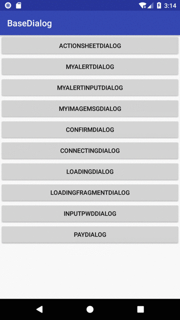
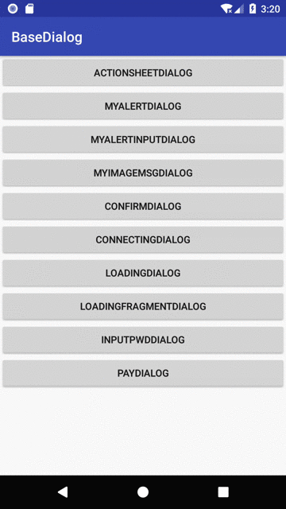
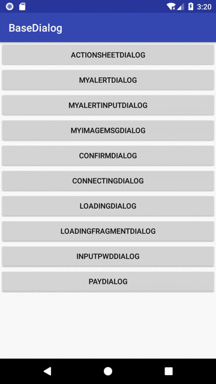
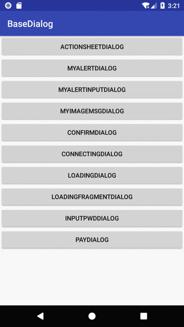
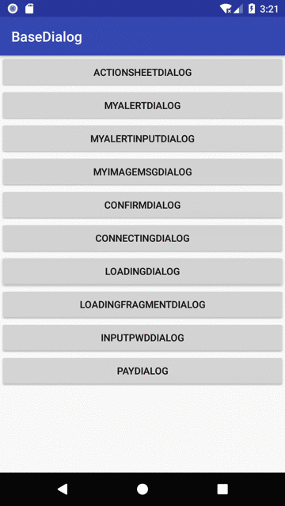

# BaseDialog

常用的提示框，输入框，弹窗等

### 使用方式

Step 1. Add the JitPack repository to your build file<br/>

Add it in your root build.gradle at the end of repositories:
```
allprojects {
    repositories {
        ...
        maven { url 'https://jitpack.io' }
    }
}
```

Step 2. Add the dependency
```
dependencies {
    implementation 'com.github.User:Repo:Tag'
}
```

## 选择dialog



使用
```
ActionSheetDialog dialog = new ActionSheetDialog(this).builder().setTitle("请选择")
        .addSheetItem("相册", null, new ActionSheetDialog.OnSheetItemClickListener() {
            @Override
            public void onClick(int which) {
                showMsg("相册");
            }
        }).addSheetItem("拍照", null, new ActionSheetDialog.OnSheetItemClickListener() {
            @Override
            public void onClick(int which) {
                showMsg("拍照");
            }
        });
dialog.show();
```

## 确认dialog


```
MyAlertDialog myAlertDialog = new MyAlertDialog(this).builder()
        .setTitle("确认吗？")
        .setMsg("删除内容")
        .setPositiveButton("确认", new View.OnClickListener() {
            @Override
            public void onClick(View v) {
                showMsg("确认");
            }
        }).setNegativeButton("取消", new View.OnClickListener() {
            @Override
            public void onClick(View v) {
                showMsg("取消");
            }
        });
myAlertDialog.show();
```



```
ConfirmDialog confirmDialog = new ConfirmDialog(this);
confirmDialog.setLogoImg(R.mipmap.dialog_notice).setMsg("提示");
confirmDialog.setClickListener(new ConfirmDialog.OnBtnClickListener() {
    @Override
    public void ok() {

    }

    @Override
    public void cancel() {

    }
});
confirmDialog.show();
```

## 可以输入内容的确认框


```
final MyAlertInputDialog myAlertInputDialog = new MyAlertInputDialog(this).builder()
                .setTitle("请输入")
                .setEditText("");
myAlertInputDialog.setPositiveButton("确认", new View.OnClickListener() {
    @Override
    public void onClick(View v) {
        showMsg(myAlertInputDialog.getResult());
        myAlertInputDialog.dismiss();
    }
}).setNegativeButton("取消", new View.OnClickListener() {
    @Override
    public void onClick(View v) {
        showMsg("取消");
        myAlertInputDialog.dismiss();
    }
});
myAlertInputDialog.show();

```

## 连接dialog



```
MyImageMsgDialog myImageMsgDialog = new MyImageMsgDialog(this).builder()
        .setImageLogo(getResources().getDrawable(R.mipmap.ic_launcher))
        .setMsg("连接中...");
ImageView logoImg = myImageMsgDialog.getLogoImg();
logoImg.setImageResource(R.drawable.connect_animation);
connectAnimation = (AnimationDrawable) logoImg.getDrawable();
connectAnimation.start();
myImageMsgDialog.show();
```



```
ConnectingDialog connectingDialog = new ConnectingDialog(this);
connectingDialog.setMessage("MSG");
connectingDialog.setOnCancelListener(new DialogInterface.OnCancelListener() {
    @Override
    public void onCancel(DialogInterface dialog) {

    }
});
connectingDialog.setOnKeyListener(new DialogInterface.OnKeyListener() {
    @Override
    public boolean onKey(DialogInterface dialog, int keyCode, KeyEvent event) {
        return false;
    }
});
connectingDialog.show();
```

## 加载dialog



```
LoadingDialog loadingDialog = new LoadingDialog(this);
loadingDialog.setMessage("loading");
loadingDialog.show();
```

## 密码输入dialog


```
final MyPwdInputDialog pwdDialog = new MyPwdInputDialog(this)
        .builder()
        .setTitle("请输入密码");
pwdDialog.setPasswordListener(new MyPwdInputDialog.OnPasswordResultListener() {
    @Override
    public void onPasswordResult(String password) {
        showMsg("您的输入结果：" + password);
        pwdDialog.dismiss();
    }
});
pwdDialog.show();
```


```
final MyPayInputDialog myPayInputDialog = new MyPayInputDialog(this).Builder();
myPayInputDialog.setResultListener(new MyPayInputDialog.ResultListener() {
    @Override
    public void onResult(String result) {
        showMsg("您的输入结果：" + result);
        myPayInputDialog.dismiss();
    }
}).setTitle("支付");
myPayInputDialog.show();
```